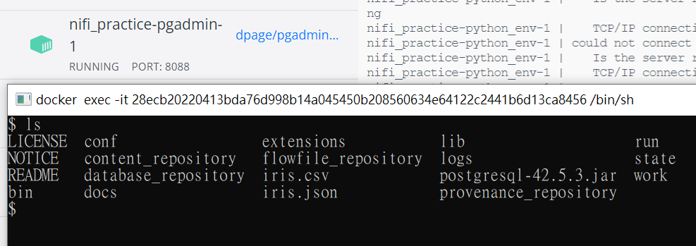
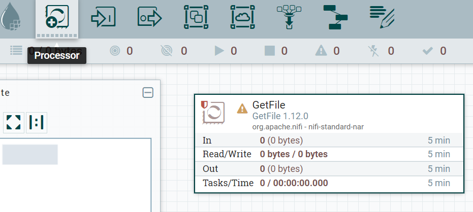
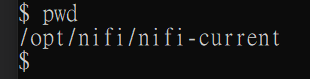
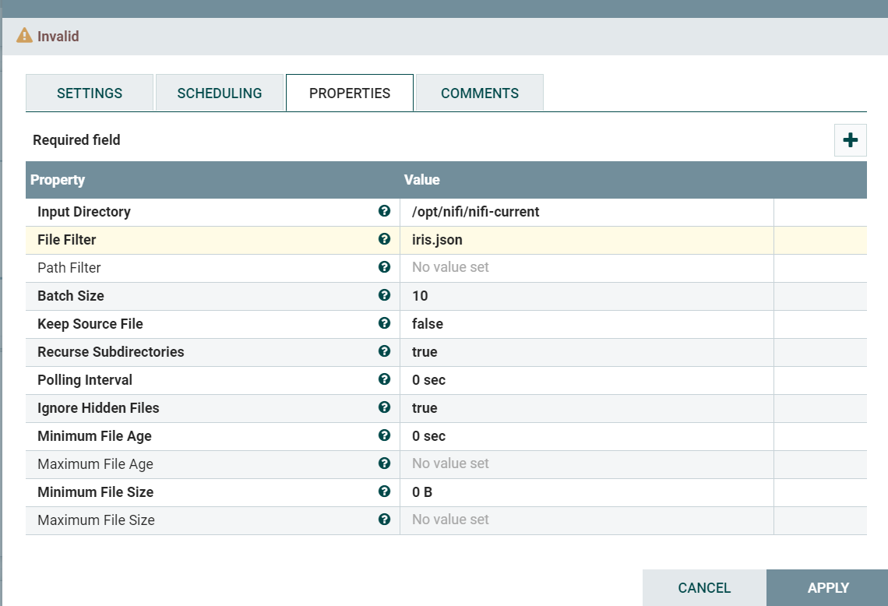
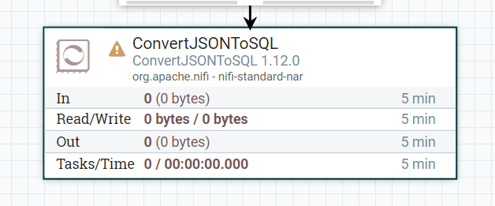
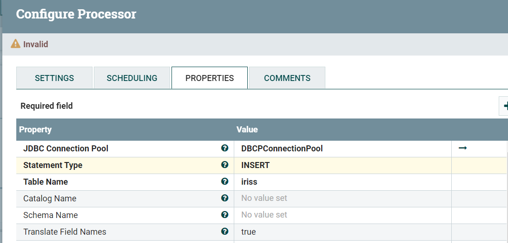
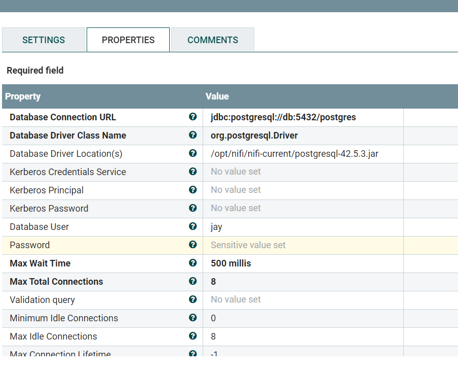
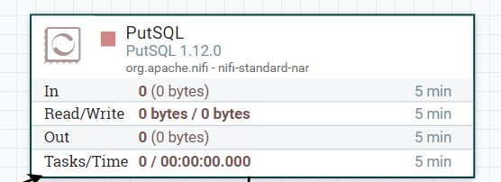
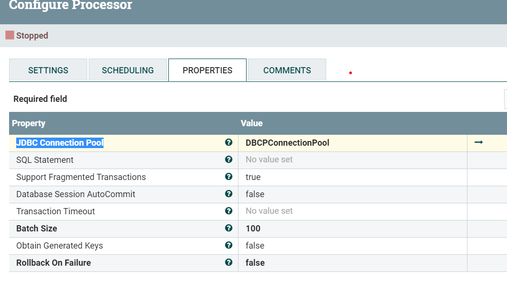
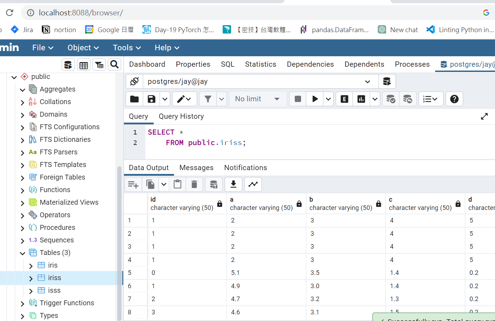

 
 
 ### Introduction
 In this lab, I will show you how to use nifi to do ETL streaming data.

### Use Docker to create your environment

- install Docker on your computer
- use the instructions to generate your environment
    ```
    docker compose up
    ```
- access to [localhost:8080/nifi](http://loaclhost:8080/nifi) and check your nifi  has been created successfully

- use any kind of familiar database GUI and connect to your PostgreSQL database
    ```
    POSTGRES_DB: postgres
    POSTGRES_USER: jay #postgres
    POSTGRES_PASSWORD: 1234 #1234
    POSTGRES_PORT: 5432 #1234
    ```

### Start processing streaming data 

- access to [localhost:8080/nifi](http://loaclhost:8080/nifi)
- check your iris.json file in docker environment

- go back to nifi web page and click Processor and choose **GetFile**

- go back to nifi web page and click Processor and choose **GetFile**
- You can use **pwd** on your nifi environment to check your iris.json path 

- click the right button on **GetFile** and set your **input directory** and **file filter** and click **Apply**

- click Processor and choose **ConverJsonToSQL**

- click right button and set your **statement type** , **table name**(you should create the schema in database first) ,**JDBC Connection Pool**

- click the arrow in **JDBC Connection Pool**, and set the properties on **Configure Controller Service** because the driver i have already dockerize in our environment, so you only need to import the file path.
    ```
    Database Connection URL: jdbc:postgresql://db:5432/postgres
    Database Driver Class Name : org.postgresql.Driver
    Database Driver Location(s) : /opt/nifi/nifi-current/postgresql-42.5.3.jar
    user : jay
    account : 1234
    ```

    

- click Processor and choose **PutSQL**
    

- set your **JDBC Connection Pool** on **PutSQL** you just set before
    

- use Funnel to collect your failed information and successful information
![put SQL]
- Press the right button and start your streaming pipeline.

### Check the data 
- go back to your familiar database GUI, if you don't have and tools, you can access localhost:8088 to use **pgadmin** to check your data is in database success or not.
- You can discover your data has already in your database, you can use the SQL below to check your data
    ```
    select * from iriss
    ```
    
- You can monitor when the JSON file comes to your file system, use the instructions below to monitor when the data comes in.
    ```
    docker cp iris.json (containerID):/opt/nifi/iris.json
    ```


### Conclusion
- in this lab, I show you how to use nifi to do the streaming task when the file come to your file system then it will upload the result to the database.
- you also can get files from your datalake like AWS S3, Azure Blob and upload your result to any kind of relational database.